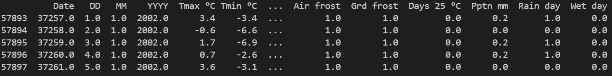
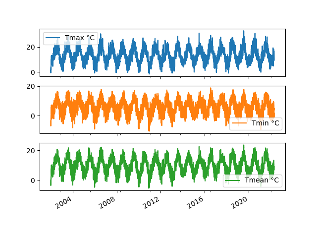
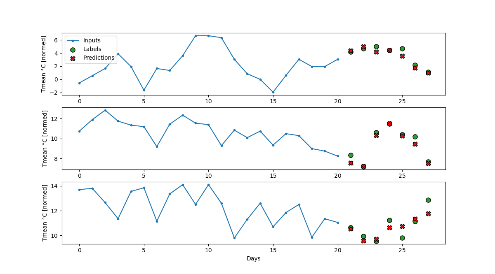

# About The Project
This is a project developed at durhack, a hackathon hosted by Durham University. The challenge for this project is 'chain of events' by Marshall Wace. My idea for this hackathon is a weather predictor using time series forecasting, a technique that uses historical data (or a chain of events) to predict future events. Time series forecasting is also used in meteorology, econometrics, quantitative finance, and statistics. Predictions will be made using the Long Short-Term Memory model (LSTM) because it has been shown that it excels at predicting sequential data, weather data is sequential in nature. Weather data is sourced from Durham University's observatory under the Daily Climate Obervations [Dataset](https://durhamweather.webspace.durham.ac.uk/open-access-climate-datasets/) [[1]](#1).

## The weather dataset
This dataset contains 10 usable features: Tmax °C, Tmin °C, Tmean °C, Tgmin °C, Air frost, Grd frost, Days 25 °C, Pptn mm, Rain day and Wet day. There are additional features in the excel file, however this data was not recorded consistently. This data was collected daily between 23/7/1843 to 30/4/2022, we will only use the last 20 years to reduce training time. 


Before the model accepts any features we need to format this data. When we access read the excel sheet we need to make sure the correct one is selected, hence the sheet_name value. First we remove the unnecessary data from the dataframe. Data recorded before 2002 and empty columns are removed:

```python
import pandas as pd

filename = "Durham-Observatory-daily-climatological-dataset.xlsx"
df = pd.read_excel(filename,sheet_name = "Durham Obsy - daily data 1843-")
df.drop(df[df["YYYY"] < 2002].index, inplace=True)
df.drop(df.columns[14:], axis = 1, inplace=True)
```
Now if we check head of the dataset we will see entries from 2002 onwards, and the fields are the features that we need:

```python
df.head()
```



The graphs below show the evolution of the features over time: Tmax °C, Tmin °C, Tmean °C. The following graphs will show similar trends, all three features measure temperature.



## Feature Engineering
Weather has clear day and year periodicity. Since we only have a day feature as the smallest unit of time, we only care about year periodicity. We can get usable signals using the sine and cosine transforms.

```python
df["Year sin"] = np.sin(day_of_year * (2 * np.pi / 365))
df["Year cos"] = np.cos(day_of_year * (2 * np.pi / 365))
```
## Data Split
We will use a 70-20-10 split for training, validation and testing.

```python
n = len(df)
train_df = df[0:int(0.7*n)]
valid_df = df[int(0.7*n):int(0.9*n)]
test_df = df[int(0.9*n):]
n_features = df.shape[1]
```

## Data Windowing
The LSTM model will make predictions based on 'windows' of data. Windows of data will be generated by the GenWindow class. It will also take up the training, validation and testing data and convert it into a dataset of windows.
```python
class GenWindow():
    def __init__(self, input_width, label_width, shift,
               train_df=train_df, valid_df=valid_df,
               test_df=test_df):
        self.input_width = input_width
        self.label_width = label_width
        self.shift = shift
        self.train_df = train_df
        self.valid_df = valid_df
        self.test_df = test_df
 
        self.column_indices = {name: i for i, name in enumerate(train_df.columns)}
        self.window_size = input_width + shift

        self.input_slice = slice(0, input_width)
        self.input_indices = np.arange(self.window_size)[self.input_slice]

        self.label_start = self.window_size - self.label_width
        self.labels_slice = slice(self.label_start, None)
        self.label_indices = np.arange(self.window_size)[self.labels_slice]
```

## Split windows
The split_window method will convert them to a window of inputs and a window of labels.

```python
def split_window(self,features):
    inputs = features[:,self.input_slice]
    labels = features[:,self.labels_slice,:]

    inputs.set_shape([None, self.input_width, None])
    labels.set_shape([None, self.label_width, None])

    return inputs, labels
```

## Plot
The plot method allows for the visualization of network performance.

```python
def plot(self, model):
    inputs, labels = self.example
    plt.figure(figsize=(12, 8))
    plot_col_index = self.column_indices["Tmean °C"]
    max_n = min(3, len(inputs))

    for n in range(max_n):
        plt.subplot(max_n, 1, n+1)
        plt.ylabel(f"{"Tmean °C"} [normed]")
        plt.plot(self.input_indices, inputs[n, :, plot_col_index],
                label="Inputs", marker=".", zorder=-10)

        if plot_col_index is None:
            continue

        plt.scatter(self.label_indices, labels[n, :, plot_col_index],
                        edgecolors="k", label="Labels", c="#2ca02c", s=64)
            
        if model is not None:
            predictions = model(inputs)
            plt.scatter(self.label_indices, predictions[n, :, plot_col_index],
                    marker="X", edgecolors="k", label="Predictions",
                    c="#ff0e0e", s=64)

        if n == 0:
            plt.legend()

    plt.xlabel("Days")
```

## Multi LSTM model
The multi LSTM model uses a long history of inputs. The model will accumulate data for 3 weeks before making a prediction for the next week. Batch normalization and dropout layers are added to prevent underfitting.
```python
multi_lstm_model = tf.keras.Sequential([
    tf.keras.layers.BatchNormalization(),
    tf.keras.layers.LSTM(252, return_sequences=False),
    tf.keras.layers.BatchNormalization(),
    tf.keras.layers.Dropout(rate = 0.2),

    tf.keras.layers.Dense(252),
    tf.keras.layers.BatchNormalization(),
    tf.keras.layers.Dropout(rate = 0.3),
    tf.keras.layers.Dense(OUTPUT_STEPS*n_features,
                          kernel_initializer=tf.initializers.zeros()),

    tf.keras.layers.Reshape([OUTPUT_STEPS, n_features])
])
```

## Results
The results show that the model was successful in predicting the mean temperature one week into the future!



## References
<a id="1">[1]</a>
Burt, Stephen and Burt, Tim, 2022. Durham Weather and Climate since 1841. Oxford University Press, 580 pp.

